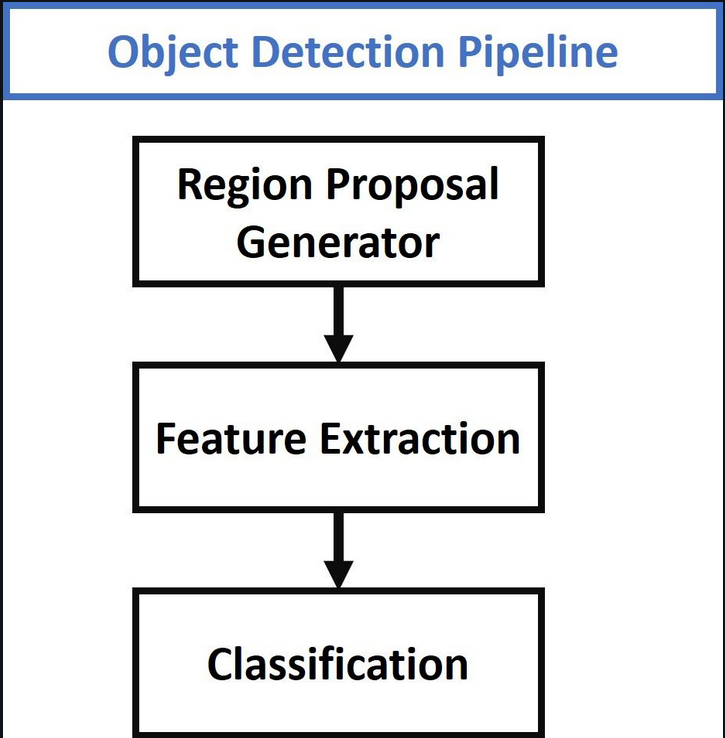
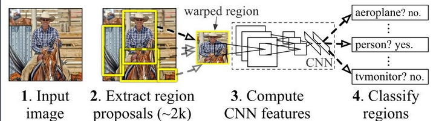
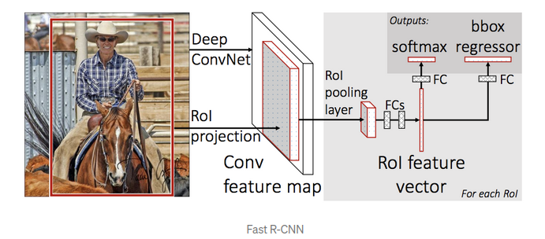
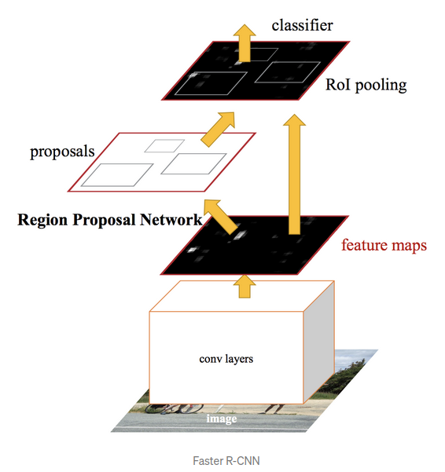

## Table of Contents
1. [The Object Detection Pipeline](#the-object-detection-pipeline)
2. [R-CNN](#r-cnn)
3. [Fast R-CNN](#fast-r-cnn)
4. [Faster R-CNN](#faster-r-cnn)

### The Object Detection Pipeline

Traditional object detection techniques follow the 3 major steps given in the figure below.

* **The first** step is to generate several region proposals. These region proposals are candidates that could contain objects. The number of these regions is usually several thousand.
Example of the algorithms used in this step : 
    - Selective Search 
    - EdgeBoxes

* **the second** step , various image descriptors will extract a feature victor of fixed lenght.
Exemple of image descriptors :
    - histogram of oriented gradients.

* **The third** each vector is passed to a classifier that will assign the vector to a specifique class.
Exemple of classifiers:
    - Support vector machine

### R-CNN
The main difference from the traditional pipeline is that R-CNN uses convolutional neural network (CNN) for the features extraction.

 

### Fast R-CNN
The issues with R-CNN are related to its slowness, as there is over 2000 proposed regions we can imagine how long it will take to treat all of them.

The idea behind Fast R-CNN is to add a new layer called region of interest (ROI) Pooling that extracts equal-length feature vectors from all proposals (i.e. ROIs) in the same image.

Instead of feeding the region proposals to the CNN, we feed the input image to the CNN to generate a convolutional feature map. From the convolutional feature map, we identify the region of proposals and warp them into squares and by using a RoI pooling layer we reshape them into a fixed size so that it can be fed into a fully connected layer.

  

### Faster R-CNN
Both of the above algorithms(R-CNN & Fast R-CNN) uses selective search to find out the region proposals. Selective search is a slow and time-consuming process affecting the performance of the network.

Similar to Fast R-CNN, the image is provided as an input to a convolutional network which provides a convolutional feature map. Instead of using selective search algorithm on the feature map to identify the region proposals, a separate network is used to predict the region proposals. The predicted region proposals are then reshaped using a RoI pooling layer which is then used to classify the image within the proposed region and predict the offset values for the bounding boxes.
