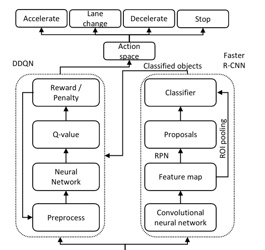

## Table of Contents
1. [General Overview](#general-overview)
2. [Creating Dataset](#creating-dataset)
3. [Creation and training of the model](#creation-and-training-of-the-model)
4. [Testing the Model](#testing-the-model)
5. [The start of DQN](#the-start-of-dqn)

### General Overview
Understanding how object detection works is very important for interpreting the results you get from your model and how to feed it with data, so before continuing I suggest you at least see Faster-RCNN.md before continuing this one.

after executing the first notebook you will have a directory like this :

### Creating Dataset
One of the most important steps is to create your own dataset, filter all the boxes and create an annotation file.

to create my dataset, I used fiftyone to import 15000 images from Open Image V6. fiftyone is very easy to use, just specify the dataset you want and the classes you are looking for. 
The distribution of our dataset is as shown below:

after filtering the dataset to only have what matters to our model your dataset should look-like this:

then we export the dataset to an annotation file and replacing Imageid with the full image path.

### Creation and training of the model
Then you can create your own model architecture from scratch or use an existing model, in my case I used fasterrcnn_mobilenet_v3_large_fpn without pre-trained weights.

I trained my model for 20 epochs (3 images/epoch).
in my training i only calculated the total loss , but in reality there is mutiple losses related to classification or bounding boxes.

total loss means the sum of all the losses.

# Curves
for the first epoch i got:

For all epochs we have this miss: 

to understand it i just calculated the mean values to get this smooth curve

as we can see the mean loss is getting lower and lower as epochs goes on get its final value at about 10 epochs.

Now you save your model and use it as you wish in your future projects.

### Testing the Model

I tested it in some pictures and the results are shown bellow.

We need more training and more adapted data to be optimized for teh car env.

### The start of DQN
I started to work with Carla tring to understand how thiere API works created the class for Carenv now i need to create the model for the Agent. 
my final results will be something like this.

