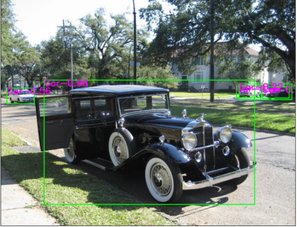

## Table of Contents
1. [General Info](#general-info)
2. [Technologies](#technologies)
3. [Installation](#installation)
5. [How to use](#how-to-use)
### General Info
***
In this projet i am tring to build a model for an autonomous car to avoid obstacles.
For this I'll be using Faster RCNN pretrained model for "object detection" and DQN for "Obstacle avoidance". 
I build the project as a tutoriel if you have just started in object detection this one may help you.
Note: For now I have just did the Object detection still working on the DQN Agent.
### Screenshot

## Technologies
***
A list of technologies used within the project:
* [Pytorch](https://pytorch.org/): Version 1.10.2 
* [Fiftyone](https://voxel51.com/): Version 0.14.4
* [Opencv](https://opencv.org/): Version 4.5.5
* [Carla](https://carla.org/): Version 0.9.13
* Some libraries: pandas, torchvision, pickle, tqdm
## Installation
***
To in start the projet you need to follow this steps first, replace "<your_env>" with a name of your choice.
```
$ git clone https://github.com/Fouadbtlb/Object_detection_and_avoidence.git
$ cd Object_detection_and_avoidence
$ conda create --name <your_env> --file requirements.txt -c conda-forge
$ python -m ipykernel install --user --name=<your_env>
$ conda activate <your_env>
$ conda install pytorch==1.9.0 torchvision==0.10.0 torchaudio==0.9.0 cudatoolkit=11.3 -c pytorch -c conda-forge
$ jupyter-notebook
```
Side information: the "ipykernel" command is to add your env to jupyter notebook kernel. Once jupyter-notebook started you have to switch kernel to your env's kernel.

### How to use
***
You just need to follow the jupyter notebooks in the same order as annotated:
* 1-Manage_data.ipynb
* 2-Model_creation_and_training.ipynb
* 3-testing_model.ipynb
* 4-dqn.py (not ready yet)
- Side files :
    * paths.py : to organize our directories and easly find the paths.
    * Mydataset.py : The Class in charge to feed the model (data loader) with images got from the annotations file that got created in the first notebook.
    * CarEnv.py : The class in charge to communicate with the python API of Carla.
    * Faster_RCNN.md :Giving some info about the history of Fatser RCNN (Fast RCNN, RCNN) and how each one works.
    * My_results.md : Giving an overview of my results with some plots.


